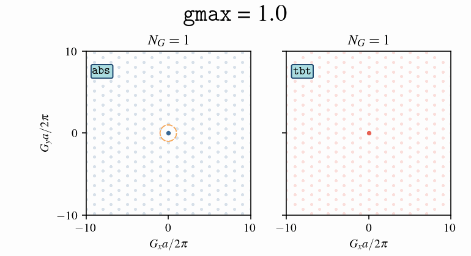
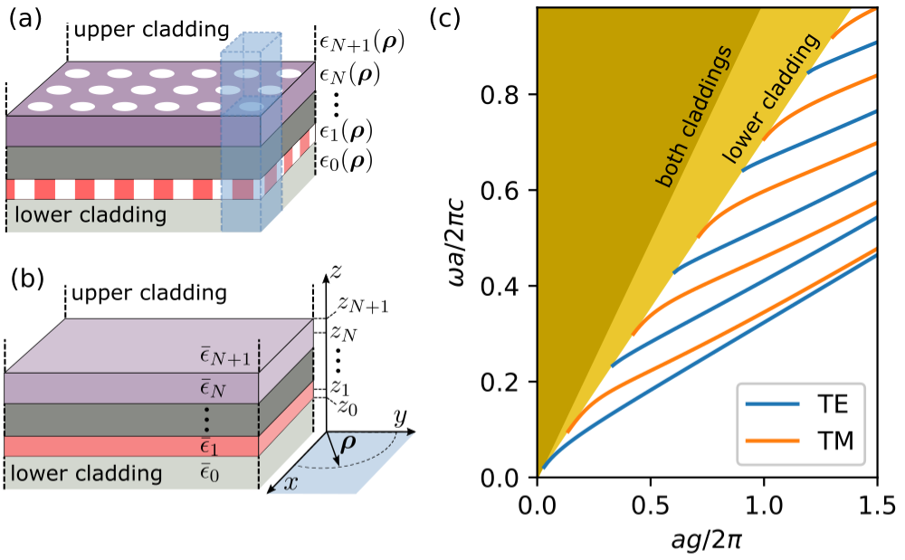

Frequently Asked Questions
==========================

What do I do to test convergence?
---------------------------------

The best way to make sure that your GME computation is converged is to increase 
the parameters controlling the precision of the simulation until you no longer
see change in the eigenmodes of interest. We recommend doing this in the 
following order:

- First, make sure you have set a high enough ``gmax``, which is defined upon 
  initialization of ``GuidedModeExp``.
- Then, increase the number of guided bands included in the simulation by 
  adding more indexes to the ``gmode_inds`` list supplied to :meth:`legume.GuidedModeExp.run`.
  Note that after including more modes in ``gmode_inds``, you should test again the 
  convergence w.r.t. ``gmax``.
- If your bands look particularly weird and discontinuous, there might be an 
  issue in the computation of the guided modes of the effective homogeneous 
  structure (the expansion basis). Try decreasing ``gmode_step`` supplied in 
  :meth:`legume.GuidedModeExp.run` to ``1e-3`` or ``1e-4`` and see if things look better.

Finally, note that GME is only an approximate method. So, even if the 
simulation is converged with respect to all of the above parameters but still 
produces strange results, it might just be that the method is not that 
well-suited for the structure you are simulating. We're hoping to improve that 
in future version of **legume**! 

How do I choose truncation of reciprocal lattice vectors?
---------------------------------------------------------

The Fourier expansion of electromagnetic fields relies on an infinite vector set `G`
as its basis. However, for practical numerical computations, it becomes necessary 
to truncate this infinite basis. The choice of the truncation rule becomes crucial,
as the results may vary for a finite number (N\ :sub:`G`) of plane waves.
It is expected that all reasonable truncation choices converge to the same result
as N\ :sub:`G` approaches infinity. In **legume**, two distinct truncation rules are
implemented:

- ``abs``: This rule defines a circular boundary in reciprocal space
  with the condition ``|G| < 2 π gmax``;
- ``tbt``: This creates a parallelogram in reciprocal space, which is suitable 
  to put the dielectric matrices in Toeplitz-block-Toeplitz form.

In both case, the number (N\ :sub:`G`) of plane waves (sometimes called `npw` in the code)
grows like the square of `gmax`.

An illustrative example of these truncation rules applied to the reciprocal
triangular lattice is shown here, where the darker points corresponds to vectors 
G included in the basis:

.. caution:: For given ``gmax``, ``abs`` and ``tbt`` may give a different number of
          plane waves N\ :sub:`G` in the basis. 

So, should I use ``abs`` or ``tbt``? ``abs`` is, in general, a safer choice since it
always preserves the underlying symmetry of any lattice. In particular,  ``abs`` should
be chosen when using symmetrization with respect to a vertical mirror plane in the hexagonal (also called triangular) lattice.
From the plot above, we can see that ``tbt`` breaks the rotational symmetry of the hexagonal lattice,
and is therefore not compatible with symmetrization. Also, ``tbt`` may give
unexpected results when the symmetry of the modes is a crucial point of the simulation.
On the other hand, the calculation of the Fourier components of the in-plane dielectric
profile is highly optimized for the ``tbt`` truncation. For this reason, when
we need to run a calculation with a large number of plane waves, 
``tbt`` is currently the best option in terms of computing time and memory usage.
Inverse design optimizations are often done with a rectangular supercell, and for
such structures  ``tbt`` is compatible with symmetrization.

.. note:: Based on these guidelines, the user should choose the truncation scheme that is most
        suited to the specific application. The choice of truncation scheme depends on the
        keyword argument ``truncate_g`` in ``GuidedModeExp``, and has the default value ``abs``.

Why am I running out of memory?
-------------------------------

GME requrest the diagonalization of dense matrices, and you might start running 
out of memory for simulations in which computational time is not that much of 
an issue. This is also because the scaling with ``gmax`` is pretty bad: the 
*linear* dimension of the matrix for diagonalization scales as ``gmax**2``, 
and so the total memory needed to store it scales as ``gmax**4``. You can improve 
the memory usage a bit by using the ``eigsh`` solver to only compute a few eigenmodes 
as discussed in the next question. But things get even 
worse in *gradient* computations. Reverse-mode autodiff is generally the best 
approach for optimization problems in terms of computational time, but this can 
sometimes come at a memory cost. This is because *all* of the intermediate 
values of the forward simulation have to be stored for the backward pass. 
So, if you are for example doing a loop through different *k*-points, the dense 
matrices and their eigenvectors at every *k* will be stored, which can add up 
to a lot. There is no easy way to fix this (and no direct way within 
``autograd``), but we've included a function that can provide a workaround. 

For details on things you can try, have a look at `this example`_.

.. _this example: examples/07_Enhancing_your_GME_optimization.html

Finally, it's worth mentioning that there are probably improvements that can 
be made to the memory usage. If anybody wants to dive deep in the code and 
try to do that, it will be appreciated! I have pointed out some ideas along 
these lines `here <https://github.com/fancompute/legume/issues/29)>`_.

Can I speed things up if I need only a few eigenmodes?
------------------------------------------------------

The options that can be supplied in :meth:`legume.GuidedModeExp.run` include 
``numeig`` and ``eig_sigma``, which define that ``numeig`` eigenmodes 
closest to ``eig_sigma`` are to be computed. However, note that the default solver 
defined by the ``eig_solver`` option is ``numpy.linalg.eigh``, which always computes 
*all* modes. Thus, ``numeig`` in this case only defines the number of 
modes which will be *stored*, but it does not affect performance. If you're 
looking for a small number of eigenvalues, you can try setting ``eig_solver = eigsh``, 
which will use the ``scipy.sparse.linalg.eigsh`` method. In *some* cases this
will be faster, so it's worth a try -- but it might also not be, since the matrix for 
diagonalization is dense, and this is why it is not the default option. Have a 
look at `this example`_ for usage.

What if I only need the Q of some of the modes?
-----------------------------------------------

In some simulations, the computation of the radiative losses could be the time 
bottleneck. In some cases, e.g. when `optimizing a cavity`_, you only need to 
compute the quality factor of a single mode. If you run the GME by default, 
the Q-s of all modes will be computed instead, but you can set the option 
``compute_im = False`` to avoid this. Running the GME with this option will 
compute all modes, but not the imaginary part of their frequencies (which is 
done perturbatively after the first stage of the computation). Then, you can 
use the :meth:`legume.GuidedModeExp.compute_rad` method to only compute the loss rates 
of selected modes.

.. _optimizing a cavity: examples/06_Guided_mode_expansion_with_autograd.html#Quality-factor-optimization

What should I know about the guided-mode basis?
-----------------------------------------------

The expansion basis in the GME consists of the guided modes of an effective 
homogeneous structure (panels (a)-(b)) in the Figure. By default, the 
effective permittivities in (b) are taken as the average value in every layer.
This is controlled by the ``gmode_eps`` keyword option in the run options. 
Setting ``gmode_eps = 'background'`` will take the background permittivity 
instead, while there's also the option to have custom values by setting
``gmode_eps = 'custom'``. In that case, every layer (including the claddings)
in the ``PhotCryst`` object should have a pre-defined effective permittivity 
``eps_eff``, which will be used in the guided-mode computation. This is simply 
set as an attribute of the layer, e.g. 

.. code-block:: python

  phc.layers[0].eps_eff = 10   # Slab custom effective epsilon
  phc.calddings[0].eps_eff = 1 # Lower cladding 
  phc.claddings[1].eps_eff = 5 # Upper cladding 

The guided modes can be classified as TE/TM, where in our notation the reference 
plane is the slab plane (xy). The guided modes alternate between TE and TM, such 
that ``gmode_inds = [0, 2, 4, ...]`` are TE and ``gmode_inds = [1, 3, 5, ...]`` 
are TM (panel (c)). However, this classification is often broken by the 
photonic crystal structure (we discuss symmetries further below).

We only include the fully-guided modes in the computation (the ones that lie
below both light lines in (c)). This is what makes the computation approximate, 
as the basis set is not complete. 

How do I incorporate symmetry?
------------------------------

The TE/TM classification of the guided modes of the homogeneous structure is 
often broken by the photonic crystal permittivity. Here is how you can still
incorporate some structural symmetries.

For gratings_ (permittivity is periodic in one direction and homogeneous in the 
other), the TE/TM classification holds. You can selectively compute the modes
by supplying `gmode_inds` with either only even or only odd numbers.
Please see example 0.2 for other hints.

For 2D structures, it is most important to distinguish between horizontal (xy) 
and vertical (kz) mirror planes, that latter may arise only if the `k`-vector points 
along specific high-symmetry directions.

For photonic crystals with a horizontal (xy) mirror plane, like a single slab 
with symmetric claddings, the correct classification of modes is with respect 
to reflection in that plane:

- the positive-symmetry, or :math:`\sigma_{xy}=+1` photonic modes are obtained by choosing a basis of guided modes such as ``gmode_inds = [0, 3, 4, 7, 8, 11 ...]``;

- the negative-symmetry, or :math:`\sigma_{xy}=-1` photonic modes are obtained by choosing a basis of guided modes such as ``gmode_inds = [1, 2, 5, 6, 9, 10, ...]``.

Low-frequency positive-symmetry modes that are mostly formed by the ``gmode_inds = [0]`` 
guided band are sometimes referred to as quasi-TE, and low-frequency negative-symmetry 
modes that are mostly formed by the ``gmode_inds = [1]`` guided band are 
sometimes referred to as quasi-TM. Please see `example 1\.1`_ for full analysis.

Without any horizontal mirror planes, all the guided modes are generally mixed. 
There can still be symmetry if the `k`-vector points in a high-symmetry direction.
The new version of **legume** (2024 version, related to the CPC paper)
allows implementing symmetry with respect to a vertical mirror plane, which 
we call a kz-plane. This is controlled by the keyword argument ``kz_symmetry``,
which can have four possible values:

- ``kz_symmetry=None``: kz-symmetry is not used;
- ``kz_symmetry='even'``: only kz-even modes are calculated ;
- ``kz_symmetry='odd'``: only kz-odd modes are calculated ;
- ``kz_symmetry='both'``: all modes are calculated, and can be separated using
  the variable `kz_symmetry=kz_symms`.

Please see `example 1\.2`_ for full analysis, `example 1\.6`_ for inverse design
using kz-symmetry, and the CPC paper for theoretical discussion.

.. _gratings: examples/03_Guided_mode_expansion_multi_layer_grating.html#Compute-quasi-guided-bands
.. _photonic crystals with a mirror plane: examples/06_Guided_mode_expansion_with_autograd.html#PhC-cavity-simulation
.. _example 1\.1: examples/11_GME_horizontal_xy_symmetry_plane.html
.. _example 1\.2: examples/12_GME_vertical_kz_symmetry_plane.html
.. _example 1\.6: examples/16_GME_W1_waveguide_optimization_with_autograd.html

How do I use the polariton module?
----------------------------------

Polaritons are the mixed modes that result from the interaction of light
with material excitation, in this case we consider 2D excitons.
To model exciton-polaritons in PhC slabs we need to calculate the
exciton eigenmodes, and photonic eigenmodes, and their mutual interaction.

Exciton eigenmodes are obtained by solving the effective-mass equation
in a confining potential, using the same plane-wave basis that is employed
for the photonic eigenmodes. The exciton-photon interaction is treated
by the Hopfield method, which leads to a non-hermitian eigenvalue problem.

The polariton class HopfieldPol is organized in a way that is similar to GuidedModeExp,
but it employs SI units and sometimes electronvolts (eV), as the exciton resonances are characterized
by real parameters like resonance energy, loss, and oscillator strength per unit area.

Please refer to `example 1\.5`_ for details on usage.

.. _example 1\.5: examples/15_excitons_and_polaritons.html

When should I use approximate gradients?
----------------------------------------

When running GME with the ``autograd`` backend, one of the ``run()`` options 
you can specify is ``'gradients' = {'exact' (default), 'approx'}``. The 
approximate option could be faster in some cases, and could actually still 
be exact in some cases. This is the high-level computational graph of the 
guided-mode expansion:

.. image:: _static/gme_graph.png
  :width: 400
  :alt: Guided-mode expansion computation graph

The ``'approx'`` option discards the gradient due to the top path in this 
graph, i.e. the gradient due to the changing basis. Only the gradient from the 
diagonalization path is included. Here are some rules of thumb on what to use:

- If you're `optimizing hole positions`_, or more generally parameters that don't 
  change the average permittivity, you're in luck! In this case, the ``'approx'`` gradients 
  should actually be exact!
- If you're optimizing dispersion (real part of eigenfrequencies), you could try using 
  ``'approx'`` gradients, as they might be within just a few percent of the exact ones. 
- If you're optimizing loss rates or field profiles
  and/or if your parameters include the layer thicknesses, then the ``'approx'`` 
  gradients could be significantly off, ``'exact'`` is recommended (and is the 
  default).

.. _optimizing hole positions: examples/06_Guided_mode_expansion_with_autograd.html#Autograd-backend

What's the gauge?
-----------------

Something to be aware of is the fact that the eigenmodes come with an arbitrary 
*k*-dependent gauge, as is usually the case for eigenvalue simulations. That is 
to say, each eigenvector is defined only up to a global phase, and this phase 
might change discontinously even for nearby *k*-points. If you re looking into 
something that depends on the gauge choice, you will have to figure out how to 
set your preferred gauge yourself.

Of course, apart from this global phase, all the *relative* phases should be 
well-defined (as they correspond to physically observable quantities). So for 
example if you compute `radiative couplings`_ to S and P polarization, the 
relative phase between the two should be physical. 

.. _radiative couplings: examples/03_Guided_mode_expansion_multi_layer_grating.html#Asymmetric-coupling

How can I learn more about the method?
--------------------------------------

The `2020 paper <https://pubs.acs.org/doi/full/10.1021/acsphotonics.0c00327#>`_ 
gives the fundamentals on the guided-mode expansion method and on our differentiable implementation.

The 2024 manuscript submitted to Computer Physics Communications gives basic
theory and details on symmetrization with respect to a vertical mirror plane,
and on the interaction of photonic modes with excitons leading to 
photonic crystal polaritons.

How should I cite legume?
-------------------------

If you find **legume** useful for your research, we would apprecite you citing our 
`paper <https://pubs.acs.org/doi/full/10.1021/acsphotonics.0c00327#>`_. For your convenience,
you can use the following BibTex entry:

.. code-block:: latex

  @article{Minkov2020,
    title = {Inverse Design of Photonic Crystals through Automatic Differentiation},
    volume = {7},
    ISSN = {2330-4022},
    url = {http://dx.doi.org/10.1021/acsphotonics.0c00327},
    DOI = {10.1021/acsphotonics.0c00327},
    number = {7},
    journal = {ACS Photonics},
    publisher = {American Chemical Society (ACS)},
    author = {Minkov,  Momchil and Williamson,  Ian A. D. and Andreani,  Lucio C. and Gerace,  Dario and Lou,  Beicheng and Song,  Alex Y. and Hughes,  Tyler W. and Fan,  Shanhui},
    year = {2020},
    month = jun,
    pages = {1729–1741}
  }

Who made that awesome legume logo?
----------------------------------

The **legume** logo was designed by `Nadine Gilmer <https://nadinegilmer.com/>`_. She is also behind the logos for our `angler <https://github.com/fancompute/angler/>`_ and `ceviche <https://github.com/fancompute/ceviche/>`_ packages.
