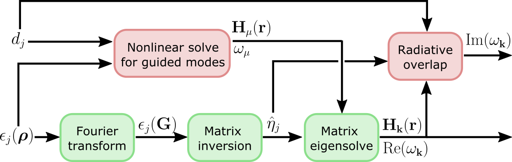

Frequently Asked Questions
==========================

What do I do to test convergence?
---------------------------------

The best way to make sure that your GME computation is converged is to increase 
the parameters controlling the precision of the simulation until you no longer
see change in the eigenmodes of interest. We recommend doing this in the 
following order:

- First, make sure you have set a high enough ``gmax``, which is defined upon 
  initialization of ``GuidedModeExp``.
- Then, increase the number of guided bands included in the simulation by 
  adding more indexes to the ``gmode_inds`` list supplied to ``GuidedModeExp.run()``.
  Note that after including more modes in ``gmode_inds``, you should test again the 
  convergence w.r.t. ``gmax``.
- If your bands look particularly weird and discontinuous, there might be an 
  issue in the computation of the guided modes of the effective homogeneous 
  structure (the expansion basis). Try decreasing ``gmode_step`` supplied in 
  ``GuidedModeExp.run()`` to ``1e-3`` or ``1e-4`` and see if things look better.

Finally, note that GME is only an approximate method. So, even if the 
simulation is converged with respect to all of the above parameters but still 
produces strange results, it might just be that the method is not that 
well-suited for the structure you are simulating. We're hoping to improve that 
in future version of **legume**! 

How do I incorporate symmetry?
------------------------------

The expansion basis in the GME consists of the guided modes of an effective homogeneous
structure. These can be classified as TE/TM, where in our notation the reference 
plane is the slab plane. The guided modes alternate between TE and TM, such 
that ``gmode_inds = [0, 2, 4, ...]`` are TE and ``gmode_inds = [1, 3, 5, ...]`` are 
TM. However, this classification is often broken by the photonic crystal 
permittivity. 

For gratings (permittivity is periodic in one direction and homogeneous in the 
other), the TE/TM classification holds. You can selectively compute the modes
by supplying `gmode_inds` with either only even or only odd numbers.

For photonic crystals with a mirror plane, like a single slab with symmetric 
claddings, the correct classification of modes is with respect to reflection in 
that plane. The positive-symmetry guided modes are 
``gmode_inds = [0, 3, 4, 7, 8, ...]``, while the negative-symmetry modes are 
``gmode_inds = [1, 2, 5, 6, 9, 10, ...]``. Low-frequency positive-symmetry 
modes that are mostly fromed by the ``gmode_inds = 0`` guided band are 
sometimes referred to as quasi-TE, and low-frequency negative-symmetry 
modes that are mostly formed by the ``gmode_inds = 1`` guided band are 
sometimes referred to as quasi-TM. 

Without any mirror planes, all the guided modes are generally mixed. There 
can still be symmetry if the `k`-vector points in a high-symmetry direction,
but there is currently no way to take advantage of that in **legume**. 

When should I use approximate gradients?
----------------------------------------

When running GME with the ``autograd`` backend, one of the ``run()`` options 
you can specify is ``'gradients' = {'exact' (default), 'approx'}``. The 
approximate option could be faster in some cases, and could actually still 
be exact in some cases. This is the high-level computational graph of the 
guided-mode expansion:

The ``'approx'`` option discards the gradient due to the top path in this 
graph, i.e. the gradient due to the changing basis. Only the gradient from the 
diagonalization path is included. Here are some rules of thumb on what to use:

- If you're optimizing hole positions, or more generally parameters that don't 
  change the average permittivity, you're in luck! In this case, the ``'approx'`` gradients 
  should actually be exact!
- If you're optimizing dispersion (real part of eigenfrequencies), you could try using 
  ``'approx'`` gradients, as they might be within just a few percent of the exact ones. 
- If you're optimizing loss rates or field profiles
  and/or if your parameters include the layer thicknesses, then the ``'approx'`` 
  gradients could be significantly off, ``'exact'`` is recommended (and is the 
  default).

How can I learn more about the method?
--------------------------------------

Our manuscript gives a lot of detail both on the guided-mode expansion method and 
on our differentiable implementation. See Minkov et al., ...

How should I cite legume?
-------------------------

If you find **legume** useful for your research, we would apprecite you citing our paper. For your convenience, you can use the following BibTex entry::

    @article{legume,
      title = {legume},
      author = { ... },
      year = {2020},
      month = feb,
      volume = { ... },
      pages = { ... },
      doi = { ... },
      journal = { ... },
      number = { ... }
    }

Who made that awesome legume logo?
----------------------------------

The **legume** logo was designed by `Nadine Gilmer <https://nadinegilmer.com/>`_. She is also behind the logos for our `angler <https://github.com/fancompute/angler/>`_ and `ceviche <https://github.com/fancompute/ceviche/>`_ packages.
