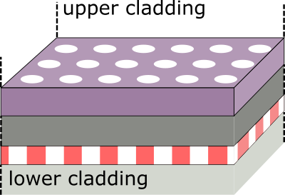
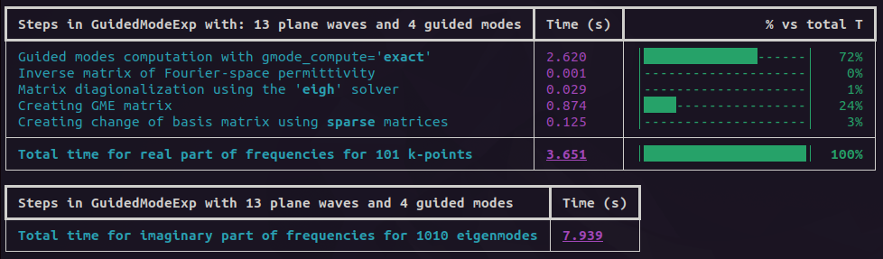

Why legume?
===========

**legume** is a python implementation of the guided-mode expansion (GME) method 
for simulating photonic crystal slabs, i.e. for multi-layer structures that
look something like this

This is an extremely efficient method to obtain the photonic Bloch bands of such
structures and can be used to study bulk photonic crystals as well as devices 
like waveguides and cavities.

The guided-mode expansion is particularly useful for computing the 
quasi-guided modes above the light line, which are hard to isolate in 
first-principle finite-difference of finite-element methods. This can be 
invaluable for the study of the coupling of photonic crystal modes to the 
radiative environment, and of exotic phenomena like
bound states in the continuum.

The GME method can be super useful in itself, but on top of that we also 
provide a differentiable implementation through the `autograd` backend. This 
allows you to compute the gradient of an objective function that depends on any 
of the ouput parameters (eigenmode frequencies and losses, fields...) with 
respect to any of the input parameters (hole positions, sizes and shapes, 
slab thickness...) With this powerful addition, there's no end to the 
possibilities in using **legume** to optimize your devices!
Inverse design with plane-wave expansion (PWE) and guided-mode expansion (GME)
is described in the `ACS Photonics paper <https://pubs.acs.org/doi/full/10.1021/acsphotonics.0c00327>`_.

Dive into the :ref:`examples` to see how this all works in practice!

`Examples 0\.1-0\.8`_ refer to the basics of PWE, GME and inverse design. 

.. _Examples 0\.1-0\.8 : examples.html#examples-01-08

New features
============

The new **legume** 1.0, linked to the `Computer Physics Communications (CPC) paper 
<https://www.sciencedirect.com/science/article/pii/S0010465524002091?dgcid=rss_sd_all>`_, 
introduces the following new features:

- symmetrization with respect to a vertical (kz) mirror plane 
- interaction between photonic modes and excitons, leading to photonic crystal polaritons

.. IMPORTANT:: `Examples 1\.1-1\.6`_ are all related to the CPC paper. 
.. _Examples 1\.1-1\.6 : examples.html#examples-for-cpc-paper-1-1-1-6

We implemented a new verbose output built on top of `rich <https://rich.readthedocs.io/en/stable/introduction.html>`_.
Here's an example: 

If you installed `rich <https://rich.readthedocs.io/en/stable/introduction.html>`_, but you prefer 
the classic verbose output just use the command ``legume.set_print_backend('base')`` at the beginnig
of your script.
